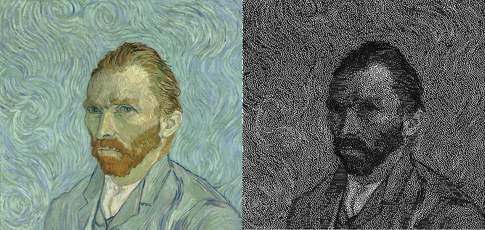

## Turtelize

A small script that uses the turtle module to recreate an image with turtle functionality.  

Parameters can be changed at the begining of the script. 
Usage: turtelize.py <filename>  
  

